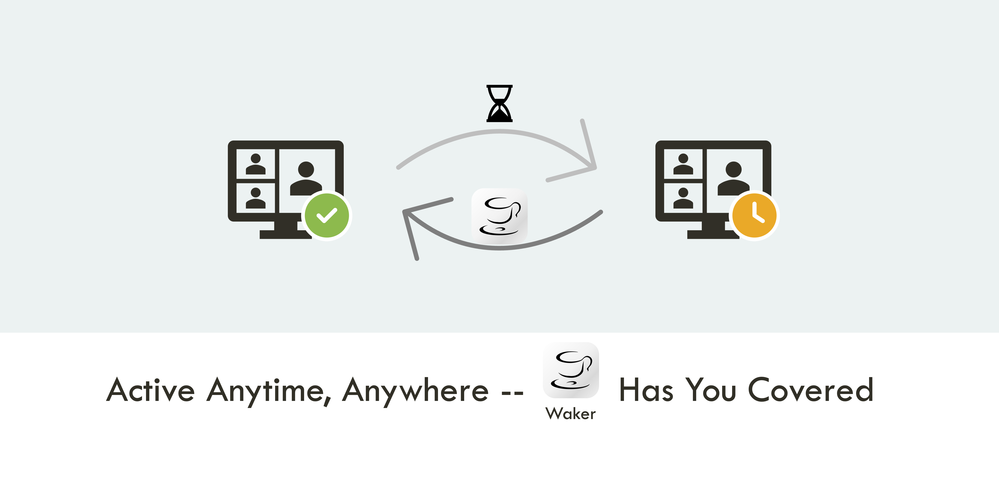
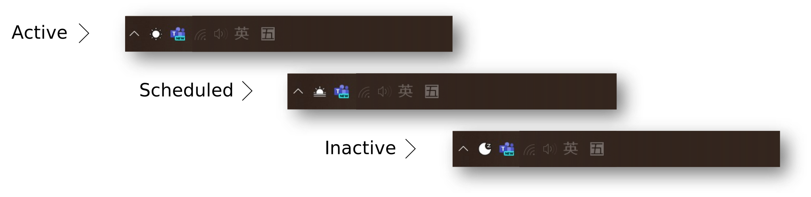
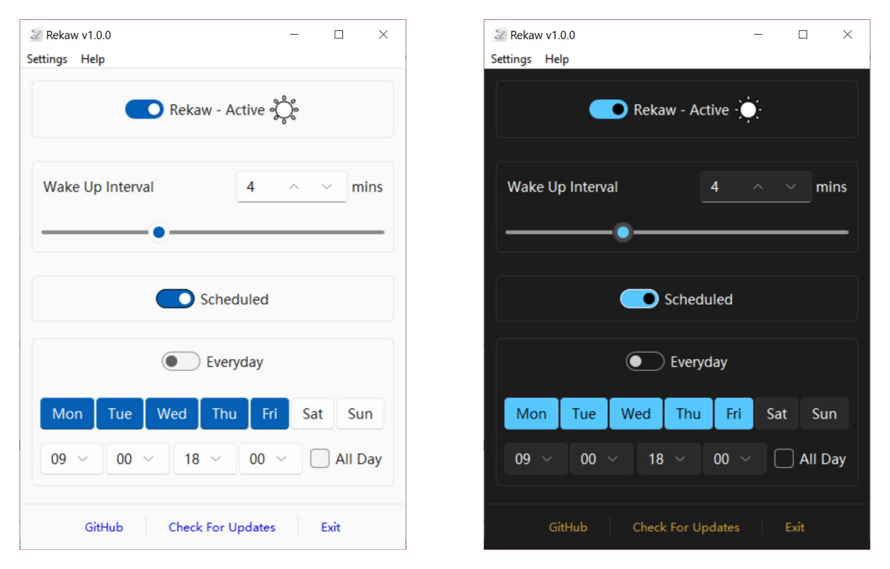
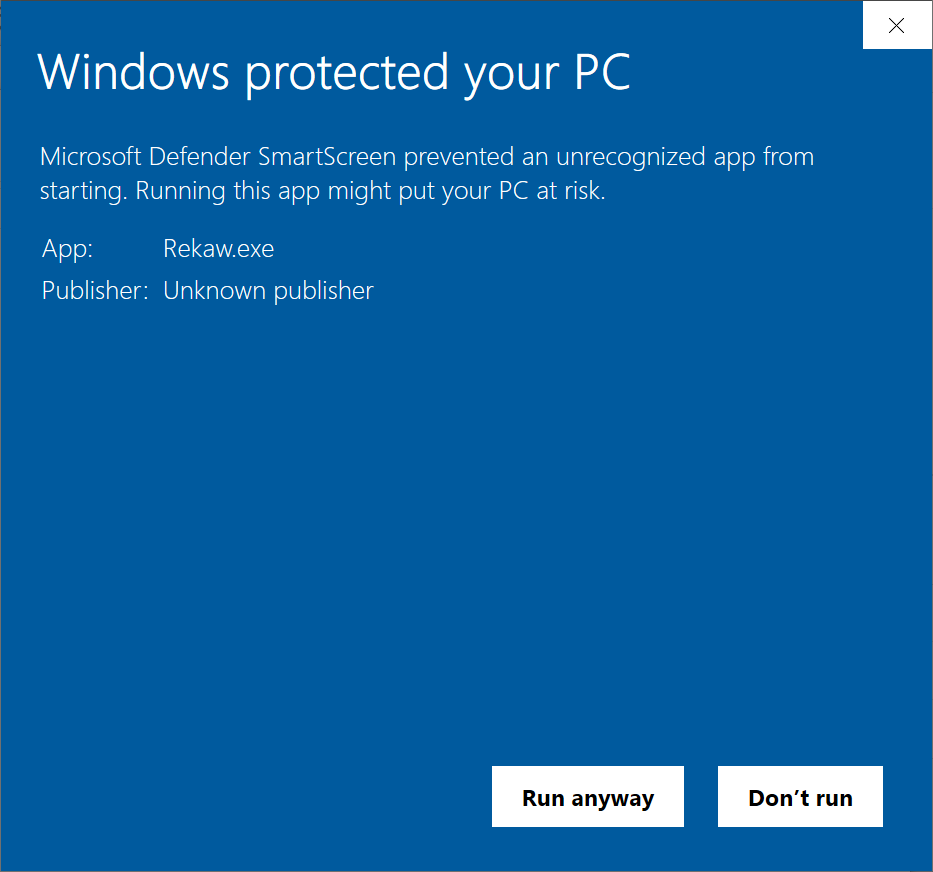
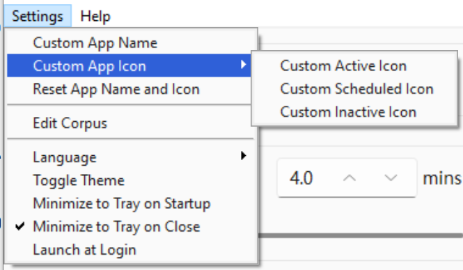

    

    English | <a href="./README_CN.md">简体中文</a>

> "_You deserve a cup of coffee!_" - Waker 

Waker is a straightforward Windows app designed to keep your PC awake and prevent "_You know what_" apps from
becoming inactive.

With Waker, you can also prevent other apps (your admin) from monitoring its status, ensuring your privacy and leisure.

# Appearance

## Menu Bar Status

## Menu Body Appearance

# Features

- 🎯 **Keep PC Awake**: Prevent your PC and related apps from becoming inactive.
- 🙈 **Anti-Monitoring**: Prevent other apps (your admin) from monitoring Waker's status.
- ⏰ **Set Wake Up Interval**: Define the interval to wake up your PC.
- ⏲ **Schedule Running Time**: Set specific times for Waker to run.
- 🚀 **Auto-Start**: Configure Waker to start automatically upon login.
- 🌒 **Dark Mode Support**: Seamlessly switch between light and dark modes.
- 🌟 **Auto-Update**: Automatically check for updates and notify you of new versions.
- 🌐 **Multi-Language Support**: Available in English and Chinese.

# Installation

1. Download the latest version of Waker's `.zip` file from
the [release page](https://github.com/ChenglongMa/waker/releases/latest).
2. Unzip the downloaded file to any directory.
3. Run `Rekaw.exe`.

> [!NOTE]
> 
> * The app is renamed to **Rekaw** (Waker spelled backward) to avoid potential monitoring by certain apps.
> * You can customize the `.exe` file name by renaming it to your preferred name **before running it**. 
> * You can customize the app's title and icons in the settings.
> 

> [!WARNING]
> 
> If you encounter a Windows Defender SmartScreen warning, click "**More info**" and then "**Run anyway**" to proceed with the installation.
> 
> 
> 

# Workflow Logic

The app will simulate your working style when you're away from your PC, preventing it from becoming inactive.

(I don't want to be too specific here, as it may attract unwanted attention.
If you want to know more, you can email me at **chenglong.m_at_outlook.com**.)

# Usage

Using Waker is intuitive, with its functionality directly accessible from its interface.

## Functionality

### Manual Running

Toggle the `Main Switch` in the app or the trap app menu to manually run or stop Waker.

### Set Wake-Up Interval

Define the **maximum** wake-up interval in the app to prevent certain apps from becoming inactive.

### Schedule Running Time

Set specific times for Waker to run, allowing for customized usage based on your preferences and workflow.

For example, you can set the app to run at **9:00 AM** and close at **6:00 PM** from **Monday** to **Friday**.

### Anti-Monitoring

As shown in the `settings` menu:
1. You can customize the app's title and icons in the settings to prevent information collection by certain apps.
2. You can edit the corpus to simulate your working behavior.

This feature will be further enhanced in future versions. Welcome to contribute!

### Auto-Update

Enable automatic update checks to stay informed about the latest versions of Waker.

You can also check for updates manually in the app menu bar settings.

# Contributing

👋 Welcome to **Waker**! We're excited to have your contributions. Here's how you can get involved:

1. 💡 **Discuss New Ideas**: Have a creative idea or suggestion? Start a discussion in
   the [Discussions](https://github.com/ChenglongMa/waker/discussions) tab to share your thoughts and
   gather feedback from the community.

2. ❓ **Ask Questions**: Got questions or need clarification on something in the repository? Feel free to open
   an [Issue](https://github.com/ChenglongMa/waker/issues) labeled as a "question" or participate
   in [Discussions](https://github.com/ChenglongMa/waker/discussions).

3. 🐛 **Issue a Bug**: If you've identified a bug or an issue with the code, please open a
   new [Issue](https://github.com/ChenglongMa/waker/issues) with a clear description of the problem, steps
   to reproduce it, and your environment details.

4. ✨ **Introduce New Features**: Want to add a new feature or enhancement to the project? Fork the repository, create a
   new branch, and submit a [Pull Request](https://github.com/ChenglongMa/waker/pulls) with your changes.
   Make sure to follow our contribution guidelines.

5. 💖 **Funding**: If you'd like to financially support the project, you can do so
   by [sponsoring the repository on GitHub](https://github.com/sponsors/ChenglongMa). Your contributions help us
   maintain and improve the project.

Thank you for considering contributing to **Waker**.

We value your input and look forward to collaborating with you!
